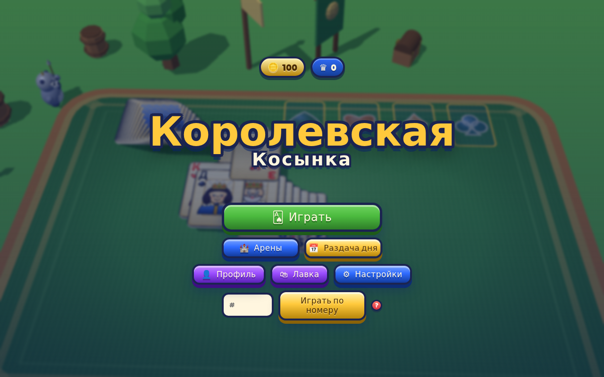

# Королевская Косынка (Royal Solitaire)

Раскладывайте карты по мастям. Победы открывают новые арены и награды.

[Играть в тестовую сборку](https://fanatat.github.io/games-dev/royal-solitaire/)

Здесь размещена собранная версия с бандлом, без исходного проекта сборки.
Тестовая сборка может отличаться от файлов этого репозитория.

**Статус на 28 сентября 2026, подтверждён владельцем:** игра опубликована
в VK. В Яндекс Играх и CrazyGames пока не опубликована.



*Локальный запуск файлов этого репозитория, 28 сентября 2026.*

## Что это

Классическая косынка со сдачей по одной или по три карты; раздачи строятся по сиду и проверяются солвером на решаемость. Поверх — мета-прогрессия: 8 арен (33 матча) со своими условиями (режим сдачи, лимит отмен), короны как валюта, сундуки трёх редкостей, таблицы рекордов по лучшему счёту и коронам.
Отмена хода, подсказка, музыка (8 треков в `music/`: меню, игра, напряжение, победа), звуковые эффекты — записи из паков Kenney (CC0) в `audio/sfx/` (Opus + MP3), встроенные шрифты в `fonts/`. Интерфейс на 11 языках: ru, en, tr, kk, pt, es, id, ar, de, fr, it.

## Стек

- Репозиторий содержит собранную версию: `index.html` и бандл в `assets/` (ES-модуль с хэшем в имени)
- Three.js/WebGL для сцены (`#scene`), DOM-слой для интерфейса (`#ui-root`)
- VK Bridge (с CDN unpkg) и Yandex Games SDK; площадка задаётся через `window.GAME_PLATFORM` в `index.html` (здесь `vk`)
- Сохранение — localStorage и облако Яндекс Игр (player data)

## Запуск локально

```bash
git clone https://github.com/Fanatat/Royal_solitaire.git
cd Royal_solitaire
python3 -m http.server 8000 --bind 127.0.0.1
```

Открыть `http://localhost:8000` (бандл — ES-модуль, с `file://` не запустится).

## Моя роль

Игра собрана командой ИИ-агентов (Claude Code) под руководством автора: постановка задачи, приёмка живым запуском и тестами, релиз — автор; код — агенты.

SDK площадок обеспечивают авторизацию, рекламу, покупки и облачные сохранения
в соответствующем окружении. Локальный HTTP-сервер не воспроизводит эти интеграции.

## Состав репозитория

`index.html` — вход и выбор платформы; `assets/` — готовый JavaScript-бандл;
`music/`, `audio/sfx/`, `fonts/` — музыка, эффекты и шрифты.
Солвер относится к подготовке раздач; отдельный отчёт его запуска здесь не опубликован.

Ресурсы сборки: [CREDITS.md](CREDITS.md).
